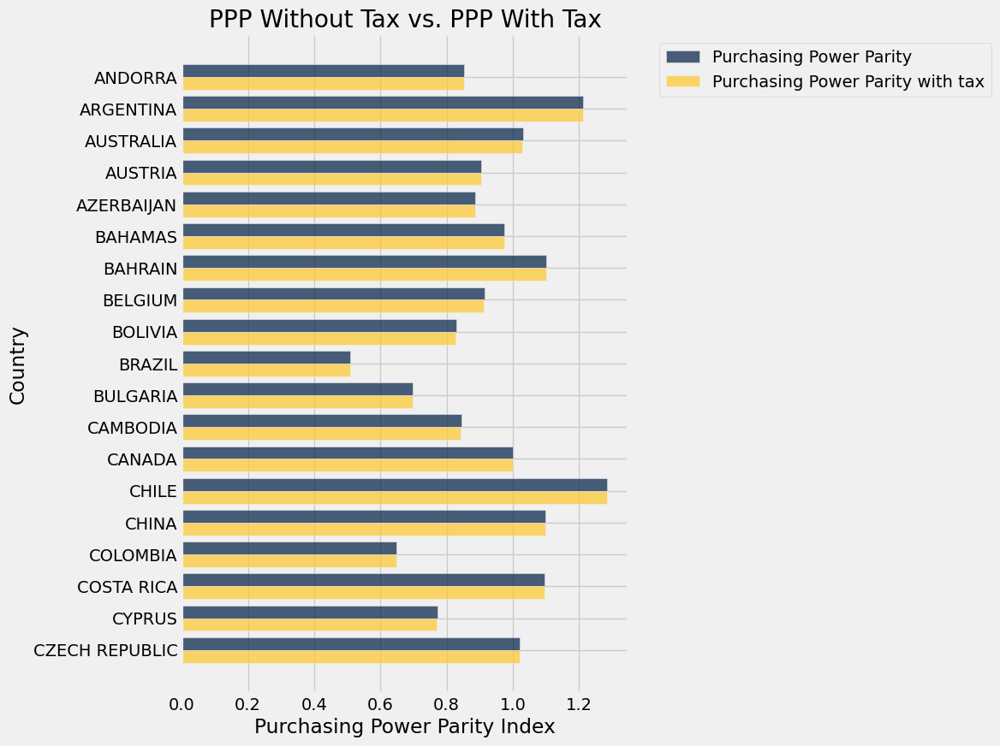
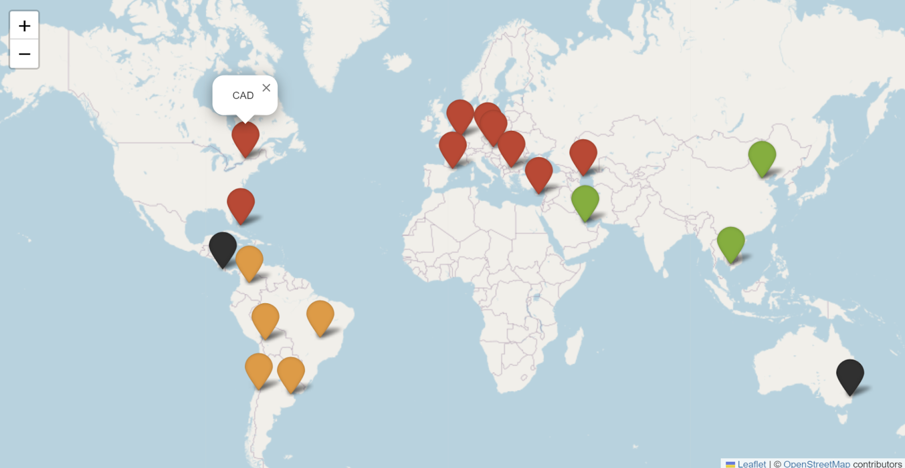
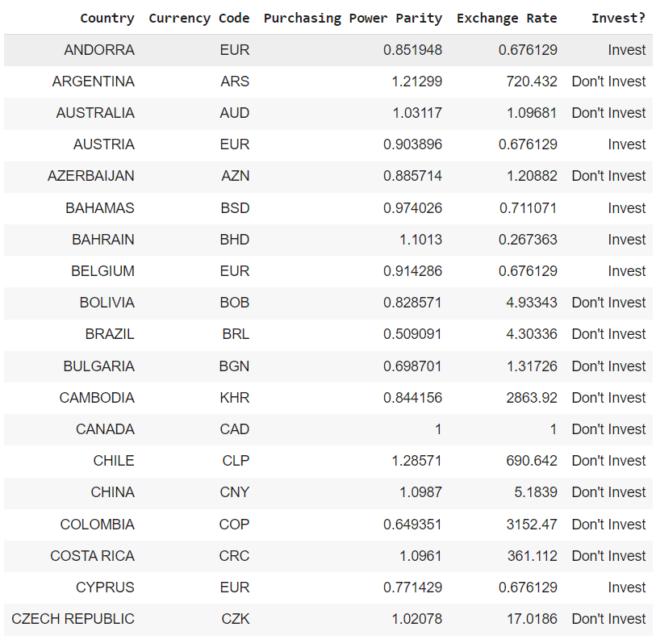
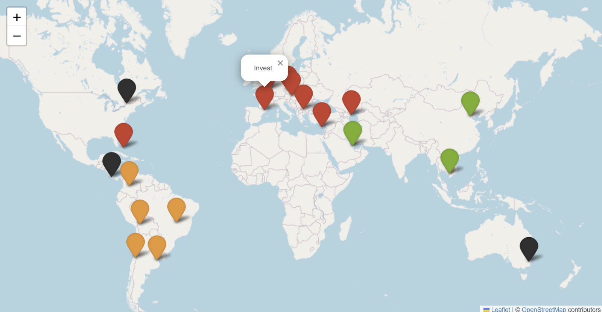

# The Starbucks Latte Index

Have you ever wondered if your dollar is valued the same no matter what country you are in? Have you ever wondered if you actually get your money’s worth when buying goods in other countries?

# Purchasing Power Parity
Understanding purchasing power parity is crucial as it can help you answer these questions. It measures the differences in price levels between countries in that country’s currency. It helps you find an exchange rate based on price levels, which may be lower or higher than the nominal exchange rate set by the Bank of Canada. Having a higher PPP than the exchange rate means that you could buy coffee in another country cheaper than what you can buy in Canada.

To make this concept more tangible, we have created a Starbucks Tall Latte Index, which shows the prices of tall lattes in different countries. This index is a practical tool to understand the implications of purchasing power parity.

# Why Starbucks Latte?
Starbucks latte is a tasty, energizing drink that many people consume daily. Starbucks is one of the most recognizable coffee companies, with many locations worldwide. Additionally, consumers worldwide expect to drink the same latte in Canada, just as in Brazil. Similarly, consumers would expect their currency's value to be the same in other countries and afford a latte across different countries for the same value.

# The Creation Of The Index
To create the Starbucks Latte Index, we took a ten-step approach detailed in Google Colab Notebook. 

Let us dive right in!

# Setting Up The Notebook

First, we imported the necessary libraries to the Google Colab notebook.

Next, we wrote the functions that we needed when interpreting the data.

After this, we proceeded to extract and analyze data.

# 1. Scraping Starbucks latte prices
We scraped data taken from Cash Net USA using the "requests" library. Scraping the data allowed us to create a detailed "table" showing the prices of tall lattes in US dollars in 19 countries. However, our "table" was not formatted as a data science table. Instead, it was an array of divs. To fix the formatting issue, we used a loop to obtain the data from each div individually and put it into the rows and columns of a data science table.

# 2. Cleaning the latte prices data and converting prices from USD to CAD
After scraping the data into a data science table, we used a function to clean the latte price column. This function strips the dollar sign in the price column and converts all the strings to floats, enabling us to use these numbers in calculations. Once our data was clean, we used it for calculations and conversions. Since the prices we scrapped were in USD, we needed to convert them to CAD. To ensure the accuracy of the conversion, we utilized another predefined function that used an imported API from FXRatesAPI for the conversions. We then applied this function to the USD prices and saved the results in a new column.
Additionally, we calculated the Purchasing Power Parity by using the price in Canada as the base price for the index and dividing every other country's price by the Canadian price. We used a function to calculate the PPP and applied it to the USD prices, as the PPP index remains the same whether using CAD or USD. We saved the results in a new column for each country's index.

The resulting table is displayed in the picture below.

# 3. Factoring local tax rates into the calculation
The prices we scraped do not include the tax each Starbucks location would charge the consumers. Therefore, we wanted to examine if sales tax will affect PPP. Therefore, we scraped the sales tax in every country from Wikipedia; since the data was split into Euro and Non-Euro tables, we combined the two tables. Then, we needed to incorporate sales tax into the calculation, which sounded to us more straightforward than it was. It was more complicated than we thought because some countries have sales tax included in their price, and some do not; some countries have provinces, states, and cities that could charge different sales taxes within the same country. To tackle the tax challenge, we took the average sales tax that a consumer will pay in a country, and for us Brazil and Canada happened to have a sales tax that varies with location; therefore, we readjusted their sales tax accordingly. Using the tax data we gathered, we calculated a new PPP that includes sales tax and saved it in a new column. 

This resulted in the following table:

To validate our expectation that there will be little to no difference between the PPP without tax and the PPP with tax, we created a bar graph that displays both indexes for each country side by side.

As we can see above, our expectation that sales tax does not change the PPP Index significantly was right.

# 4. Displaying the currencies for each country and showing the price differences

Our next objective is to display each country's currencies by symbol and code. To achieve this, we imported a CSV file that contains information about country names and their respective codes. We then selected specific columns from the imported file, relabeled column names for clarity, and joined them with our latte table to get the currency code column. After that, an essential step in our process was using a function that gave us the exchange rates for every currency code. We saved the exchange rates into an array variable so we could use it to multiply each price and get a local currency for every country. Next, we wanted to know the difference between the latte prices in Canada and other countries. Therefore, we subtracted the price of a Canadian latte from that of a converted to CAD foreign latte.

Below is a picture of the table that we have created.

This table now contains all the data we need to understand PPP.

The second part of this step was to map and label all countries with their currency codes; this required us to import data on the longitude and latitude of every country. We then created an if statement function to attach a specific colour to every continent based on certain conditions. This function was crucial in our process as it helped us visually distinguish between different continents. We then joined our data of currency codes and their respective countries with the imported data to map and display this information to the user.

# 5. Graphing the price differences between other countries and Canada
We generate a bar graph showing the price differences of foreign countries with respect to the prices of Canada. We use the barh() function to do this.

As we can see, some countries like Chile, Australia, and Belgium have unexpectedly more expensive lattes than Canada's. On the other hand, some countries like Colombia, Cambodia, Austria, and Andorra offer lattes at surprisingly lower prices than Canada's. These price differences are quite unexpected despite the consumer purchasing the same product.

Now, we want to answer the question of why this occurs. After all, one would think that if we are buying the same product made by the same company with the same ingredients, we should be paying the same amount of money for it. 

# 6. External factor: Nominal GDP per Capita
The first external factor we will examine is nominal GDP. We again imported GDP from the United Nations website in the form of a csv file and used the .join() function to add this data to our table.

# 7. Graphing Nominal GDP per Capita vs Price Differences
Then, we created a scatter plot to relate Nominal GDP per capita in CAD to price differences.

This is the plot we got. Calculating the correlation coefficient, we get an r value of 0.18716967518. This coefficient suggests a weak correlation between the price difference of Starbucks' latte and a country's GDP. However, this could be due to a variety of external factors influencing the price of a Starbucks latte. For example, countries experiencing political instability often have a higher cost of living, leading to increased prices of goods. It's important to note that countries with low GDP often experience political instability simultaneously (Aisen, A., & Veiga, F. J., 2013). Inflation can also impact the price of a Starbucks latte, with countries with high inflation rates also experiencing higher living costs. 

# 8. External Factors: Human development index scores and price differences

Looking at another external factor similar to the ones mentioned above, we now take a look at Human Development Index scores, a measure of the well being of a citizen of a country based on three criteria: health, knowledge, and standard of living.

Comparing this bar graph to the bar graph of price differences, we can see a general trend where countries who have lower HDI values tend to have higher negative price differences with that of Canada. While this observation does not hold for all countries, it does help to further contextualize why these differences in purchasing power parity occur.

# 9. External Factors: Exchange rates vs PPP
As a critical concept explaining the price differences in different countries, PPP is crucial in guiding investment decisions. By comparing it to the exchange rate for every currency, we can determine the potential value of the Canadian dollar. This understanding of PPP significantly enhances the sense of expertise of Starbucks executives, making them feel more knowledgeable and competent in their investment decisions, thereby boosting their confidence. 

We devised a map to engage Canadian consumers and Starbucks executives in a strategic understanding of the countries where they can enjoy more Starbucks lattes or, as an executive, where their investments would yield higher returns. To craft this map, we employed a for loop that evaluates the PPP of each country against the exchange rate. If the PPP surpasses the exchange rate, it signifies a investment opportunity where the currency is actually undervalued compared to its set exchange rate.

# 10. Conclusions based on findings
In conclusion, explaining the differences in PPP per country needs a more comprehensive approach that considers multiple factors in understanding price differences, rather than attributing them to a single cause. 

Based on our findings, Starbucks executives should consider the promising potential of investing in countries with higher PPP than exchange rates. These countries, with their lower price levels than the currency you can exchange in the bank, offer a unique opportunity. Selling coffee in these countries can yield higher returns when you convert your earnings back into Canadian dollars after the currency appreciates, presenting a hopeful outlook for your investment strategy. However, it's crucial to exercise caution. While countries with higher PPP than exchange rates may seem attractive for investment, other factors could be at play. High inflation rates or political instability, for instance, could significantly impact the value of your investments. Considering these risks before making investment decisions and fostering a sense of prudence and responsibility in your investment approach is essential.

For consumers, the prospect of visiting countries with higher PPP than exchange rates is indeed exciting. Your dollar can stretch further in these countries, allowing you to purchase more goods than in countries with a lower PPP than the exchange rate. However, it's crucial to be mindful of potential political instability when planning your visit, as this could impact your travel experience.

Ultimately, if you are a Starbucks lattes fan looking to maximize its consumption or minimize its cost, you can use our map to find the best country to get more of it! Similarly, our map could guide you to the right investment location if you are a Starbucks executive looking to maximize the company's return on investment, instilling a sense of guidance and confidence in your decision-making process.

# References:
Aisen, A., & Veiga, F. J., (2013). How does political instability affect economic growth?. European Journal of Political Economy, 29, 151-167.

Klugman J., Rodríguez F., Choi HJ., (2011, January). Human development index, World Health Organization, https://www.who.int/data/nutrition/nlis/info/human-development-index#:~:text=The%20HDI%20is%20a%20summary,knowledge%20and%20standard%20of%20living.

United Nations Development Programme. (2020). Human Development Report 2019 – Technical notes. https://web.archive.org/web/20210606201849/http://hdr.undp.org/sites/default/files/hdr2020_technical_notes.pdf.

https://www.cashnetusa.com/blog/starbucks-price-every-country/

https://en.wikipedia.org/wiki/Value-added_tax#Around_the_world 

https://public.opendatasoft.com/explore/dataset/currency-codes/table/ 

https://unstats.un.org/unsd/snaama/Basic https://en.wikipedia.org/w/index.php?title=Gross_domestic_product&useskin=vector#GDP_per_capita

Insanely Good Recipes. (n.d.). *Copycat Starbucks Pumpkin Spice Latte Recipe*. Pinterest. Retrieved December 2, 2024, from https://ar.pinterest.com/pin/365917538496010170/. 
